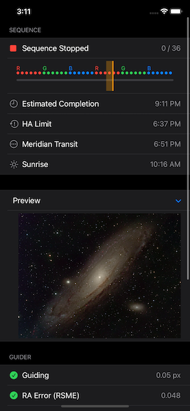
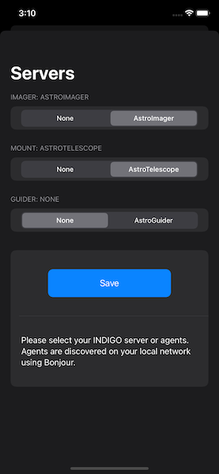

# INDIGO to GO
Monitor services using the INDIGO astronomy protocol from iOS &amp; Mac Catalyst 

* Uses Bonjour to discover agents on the network
* Reports sequence in progress
* progress bar images are colored according to my guess of your filter names
* Respects when sequence repeats
* Estimates completion time
* Calculates meridian and HA limits
* Displays filename of last image — eventually will display the image too but that's currently broken
* Displays cooler status
* Display guiding status & RMSE

INDIGO to GO runs on any iPhone or iPad running iOS 14, and also any Mac running macOS 11.

For more information, see https://github.com/indigo-astronomy/indigo and http://indigo-astronomy.org. For unrelated commercial clients for macOS, see http://www.cloudmakers.eu.
