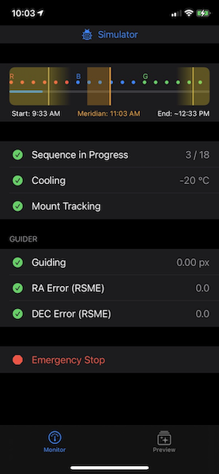
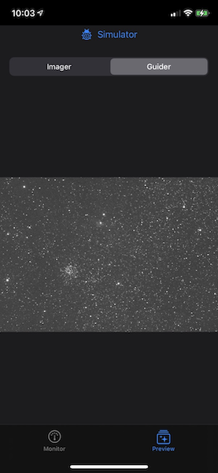
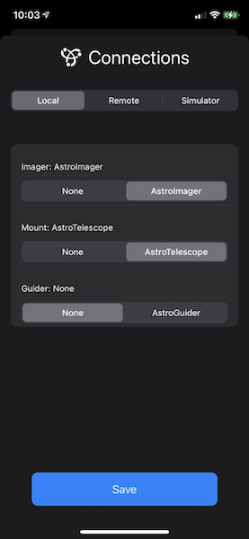
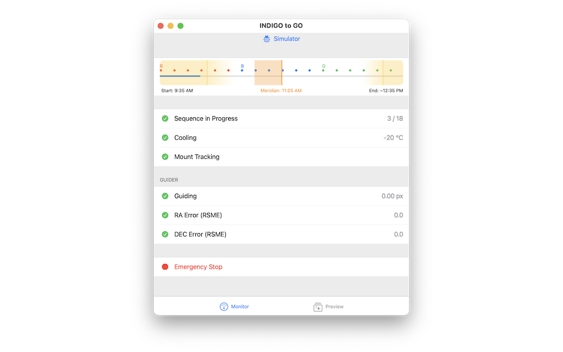

# INDIGO to GO
Monitor services using the INDIGO astronomy protocol from iOS &amp; Mac 

INDIGO to GO complements a suite of services for astrophotography. Plan your nightly sequence of imaging, monitor guiding, and track your progress.

As the name implies, this software works only with INDIGO agents, such as the open source <a href="https://github.com/indigo-astronomy/indigo">Indigo server</a>, the indigosky server for Raspberry Pi, and the excellent commercial <a href="http://www.cloudmakers.eu">AstroImager, AstroDSLR, AstroTelescope and AstroGuider</a> apps for macOS.

You can monitor equipment on your local network or, when the Mac app is paired with INDIGO to GO for iOS, you can monitor from anywhere.

Features:
- Uses Bonjour to discover agents on the network
- Progress bar is colored according to my guess of your filter names
- Calculates completion time, meridian, HA limits, and sunrise
- Displays a live preview of the latest image & guider camera image
- Displays cooler status, guiding status & guiding error
- One-button emergency stop to park your mount and turn off the camera cooler
- Focus on privacy to publish only anonymous data to the cloud, when desired

   

INDIGO to GO runs on any iPhone or iPad running iOS 14, and also any Mac running macOS 11 "Big Sur".

For more information, see https://github.com/indigo-astronomy/indigo and http://indigo-astronomy.org. For unrelated but fansastic commercial clients for macOS, see http://www.cloudmakers.eu.
